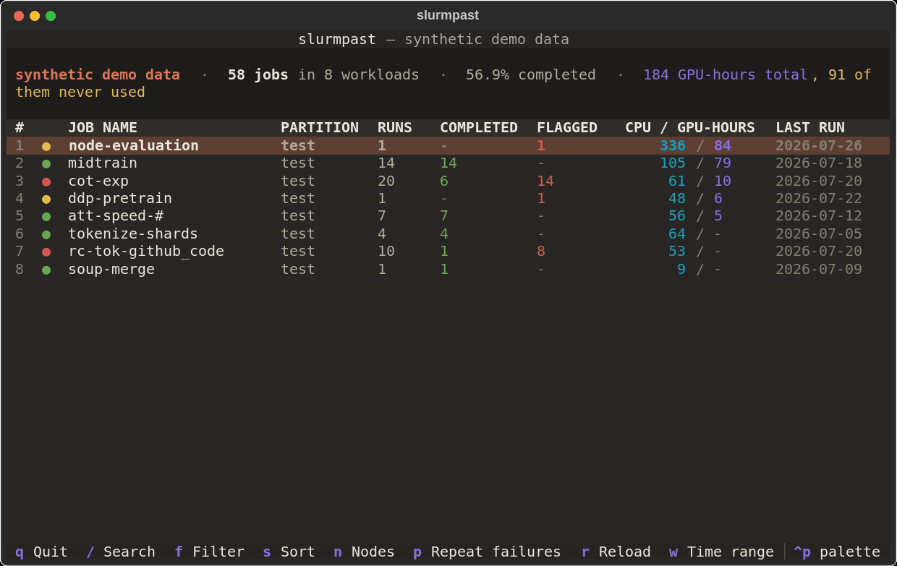
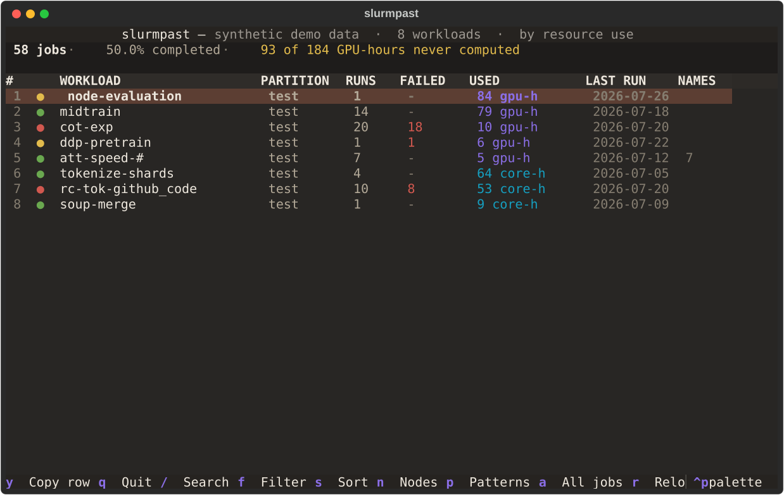
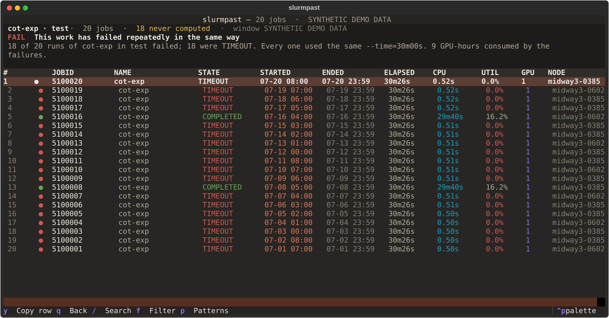
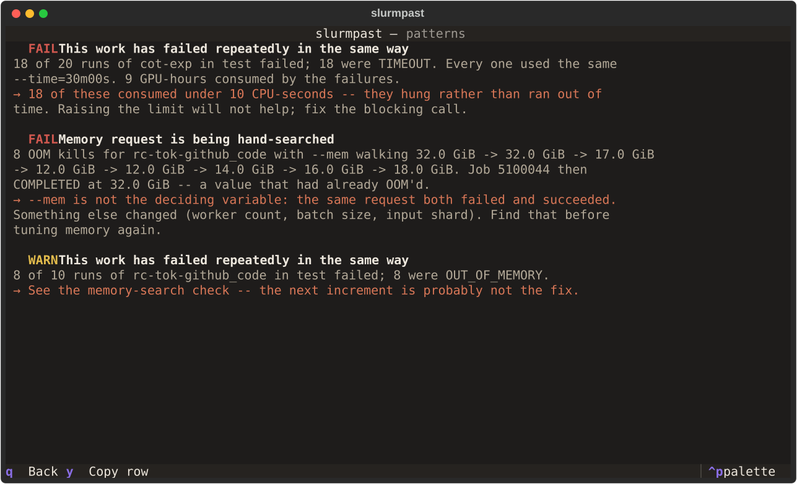
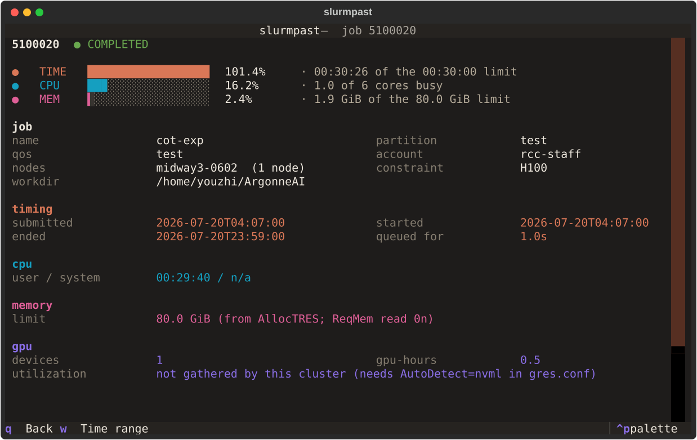
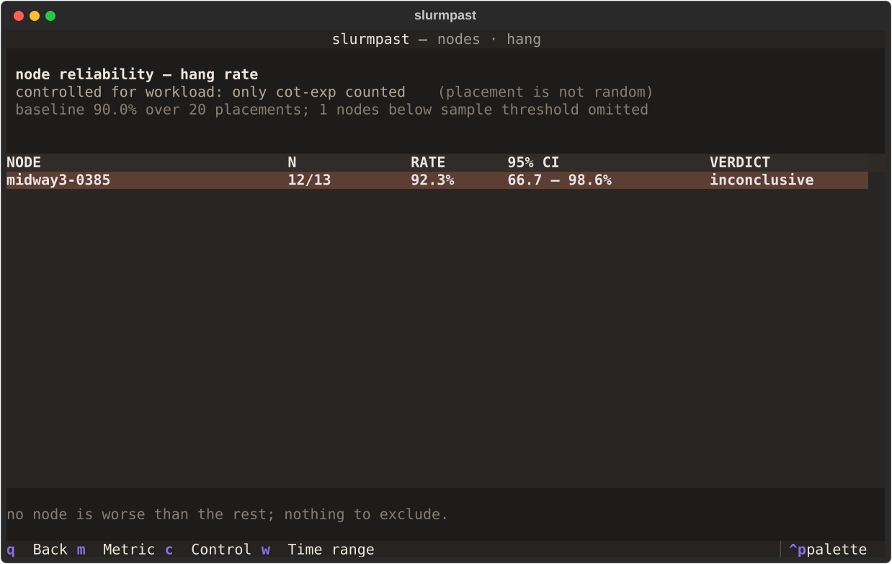

<h1 align="center">slurmpast</h1>

<p align="center">
  <strong>How your finished Slurm jobs actually ran — and what the next one should ask for.</strong>
</p>

<p align="center">
  <a href="https://pypi.org/project/slurmpast/"></a>
  <a href="https://github.com/PursuitOfDataScience/slurmpast/actions/workflows/ci.yml"></a>
  
  
  
</p>

<p align="center">
  
</p>

<p align="center">
  <sub>Recorded against <code>slurmpast --demo</code>, which is why the header reads
  <code>synthetic demo data</code> throughout. Regenerate with
  <code>python tools/demo_gif.py</code>.</sub>
</p>

```bash
pip install slurmpast
```

```bash
slurmpast              # dashboard, last 7 days
slurmpast --sizing     # what to request next time, per workload
slurmpast 51170455     # one job, every field Slurm recorded
slurmpast --demo       # no Slurm to hand? synthetic cluster
slurmpast -u alice     # someone else's history (`-u alice,bob` for several)
slurmpast --all-users  # every account on the cluster
sp                     # short alias
```

`enter` open · `q` back · digits jump to a row · `/` search · `f` filter · `s` sort ·
`n` nodes · `p` patterns · `y` copy · `?` help

**Before** the run, [`slurmate`](https://github.com/PursuitOfDataScience/slurmate)
builds the request. **During** it,
[`slurmwatch`](https://github.com/PursuitOfDataScience/slurmwatch) watches.
**After** it, `slurmpast` tells you what happened and what to change.

<details>
<summary>The same screens as stills</summary>

<p align="center">
  
</p>

<p align="center">
  
</p>

<p align="center">
  
</p>

Regenerate with `python tools/screenshots.py`.

</details>

---

## What to request next time

Over-requesting reserves capacity nobody else can use; under-requesting kills the
run. Your own history settles both.

```
argonne35-pretrain   test · 101 runs
  --time            raise to 10:00:00   (from 08:05:00)
      longest of 90 completed runs took 07:58:23.
  --mem             already about right
  --cpus-per-task   already about right
  #SBATCH --time=10:00:00
```

That workload was running on a seven-minute margin. With fewer than three usable
runs it says *not enough evidence* instead of guessing.

The figure it measures you against — `08:05:00` above — is the limit your **last**
run asked for, not the largest in the window. Those differ the moment you tune a
request, and the window is deliberately built to span that tuning: grouping ignores
resource magnitudes, so that raising `--mem` does not fork the history you are
trying to learn from.

## One job

<p align="center">
  
</p>

Time, CPU and memory against the limits you asked for, then every field Slurm
recorded, the log excerpts if the files are still on disk, and the findings.

## Failure, across runs

<p align="center">
  
</p>

`seff` describes one job and `slurmwatch` one live run. Neither can say *"you
submitted this 115 times and it died 99 times."* Runs group into workloads, so a
repeated failure — and the node it keeps landing on — is visible at a glance, with
a ready-to-paste `--exclude`.

That `--exclude` is offered only when a node is worse than the rest *after*
accounting for every other node the table tested. Without that correction a large
enough history always produces a culprit: given twenty nodes with one identical
true failure rate, testing each interval on its own named an innocent node more
than half the time.

## Correct on any cluster

`sacct` misreports in ways that are easy to miss: the requested memory is often
blank, limits are recorded per allocation but enforced per node, and a job left in
`RUNNING` inflates every total. `slurmpast` handles those, adapts to how your
Slurm version spells things, and prints `n/a` rather than `0` for anything it
cannot read.

[Every trap, and the 85 fields it extracts →](docs/details.md)

## As a library

The analysis modules import no third-party package.

```python
from slurmpast import History, Sacct
from slurmpast.sizing import recommend

history = History(Sacct().history(user="you", since="now-30days"))
for advice in recommend(history.groups[0].jobs):
    print(advice.flag, advice.verdict, advice.suggestion)
```

`--json` emits everything — 174 values per job.

---

Slurm 20.11.8 · Python 3.10–3.13 · Textual 0.89–8.2 · MIT
